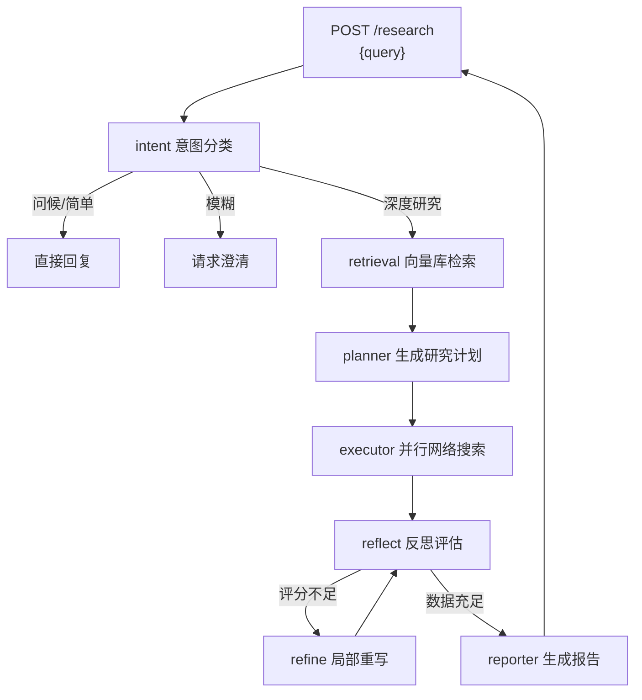

# Deep Research 🧠

**AI 驱动的自动化深度研究系统** — 输入一个问题，输出一份结构化的 Markdown 研究报告。

## 架构一览



**管线节点：** 9 个 LangGraph 节点 → 意图识别 → 向量检索 → 任务规划 → 并行搜索 → 反思评估 → 报告生成 + 质量评分

## 快速开始

### 前置条件

- Python 3.9+
- Docker（用于 Qdrant 向量数据库）
- API Key：[DeepSeek](https://platform.deepseek.com/) + [Tavily](https://tavily.com/)

### 1. 一键启动（推荐）

```bash
# 配置 API Key（编辑 backend/.env 填入密钥）
# 然后一条命令启动所有服务
docker compose up -d

# 查看日志
docker compose logs -f

# 停止
docker compose down
```

### 2. 或手动启动 Qdrant

```bash
docker run -d -p 6333:6333 qdrant/qdrant
```

### 3. 配置环境变量

```bash
cp backend/.env.example backend/.env
# 编辑 .env 填入你的 API Key
```

### 3. 安装依赖

```bash
cd backend
python -m venv .venv
source .venv/bin/activate
pip install -r requirements.txt
```

### 4. 运行

**CLI 模式（直接跑一次研究）：**
```bash
cd backend && HF_ENDPOINT=https://hf-mirror.com .venv/bin/python run.py
```

**API 模式（HTTP 服务）：**
```bash
cd backend && .venv/bin/uvicorn app.main:app --reload --port 8000
```

### 5. 调用 API

```bash
# 提交研究任务
curl -X POST http://localhost:8000/research \
  -H "Content-Type: application/json" \
  -d '{"query": "AI Agent 的发展前景"}'

# 轮询结果（替换为返回的 request_id）
curl http://localhost:8000/research/{request_id}

# 健康检查
curl http://localhost:8000/health
```

## API 文档

| 端点 | 方法 | 说明 |
|---|---|---|
| `/health` | GET | 服务状态、活跃任务数 |
| `/research` | POST | 提交研究任务（异步） |
| `/research/{id}` | GET | 查询任务状态与结果 |

## 项目结构

```
backend/
├── app/
│   ├── main.py              # FastAPI 服务入口
│   ├── graph.py              # LangGraph 图定义（9 节点）
│   ├── state.py              # ResearchState（16 字段）
│   ├── llm.py                # 共享 LLM 单例（含 timeout）
│   ├── schema.py             # IntentType 枚举
│   ├── nodes/                # 9 个管线节点
│   │   ├── intent.py         # 意图分类
│   │   ├── retrieval.py      # Qdrant 语义检索
│   │   ├── planner.py        # 研究规划
│   │   ├── executor.py       # 并行搜索执行
│   │   ├── reflect.py        # 反思决策
│   │   ├── refine.py         # 报告精炼
│   │   ├── reporter.py       # 报告生成
│   │   ├── direct_answer.py  # 直接回复
│   │   └── clarify.py        # 澄清引导
│   ├── retrieval/
│   │   └── vector_store.py   # Qdrant 封装
│   ├── tools/
│   │   └── search.py         # Tavily 搜索（缓存+入库）
│   └── utils/
│       ├── cache.py          # LRU 缓存
│       ├── report_qa.py      # 质量评分
│       └── summary.py        # 日志摘要
├── run.py                    # CLI 入口
└── requirements.txt          # 依赖锁定

test/
├── test_graph_wiring.py      # 图路由测试（11）
├── test_nodes.py             # 节点单元测试（23）
├── test_api.py               # API 测试（7）
├── test_vector_store.py      # Qdrant 集成测试（5）
└── test_qdrant.py            # 连通性检查

docs/
└── pipeline-flow.md          # 完整链路文档
```

## 运行测试

```bash
cd backend
HF_ENDPOINT=https://hf-mirror.com .venv/bin/pytest ../test/ -v
```

> 需要 Docker Qdrant 运行中才能通过向量库测试（其余 41 个测试无需外部依赖）。

## 技术栈

| 组件 | 选型 |
|---|---|
| 框架 | FastAPI + LangGraph |
| LLM | DeepSeek Chat（OpenAI 兼容 API） |
| 向量库 | Qdrant + SentenceTransformers |
| 搜索引擎 | Tavily API |
| 测试 | pytest + pytest-asyncio |

## 许可证

[MIT](LICENSE)
