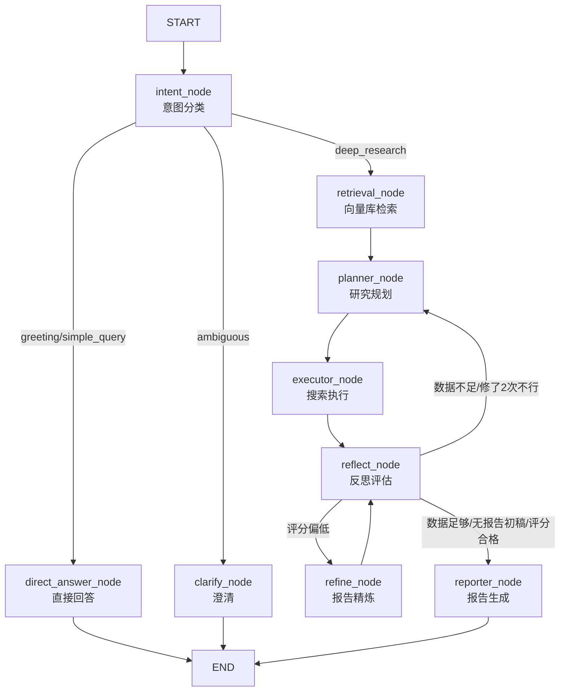

# 研究管线完整流程说明

## 整体架构



---

# 完整链路追踪：从 Query 输入到 Report 输出

---

## 一、入口：两种启动方式

### 方式 A：HTTP API（`main.py`）

```
POST /research  {"query": "AI Agent 的发展前景", "thread_id": "abc"}
```

1. 生成 `request_id = uuid[:8]`
2. 创建 `task_record`，状态 `"running"`，存入 `tasks_store`
3. `asyncio.create_task(_run_research(request_id, query, thread_id))` **后台执行**
4. 立即返回 `{"status": "running", "request_id": "..."}`
5. 客户端通过 `GET /research/{request_id}` 轮询结果

### 方式 B：CLI 入口（`run.py`）

```bash
cd backend && .venv/bin/python run.py
```

1. 加载 `.env`
2. 包一层日志上下文（request_id + thread_id）
3. 直接构造 `ResearchState` 并调用 `app.astream(state)`
4. 执行完后打印报告全文

---

## 二、State 初始化

两个入口都构造同一个 `ResearchState`：

```
query              = "AI Agent 的发展前景"
intent             = ""
messages           = []
plan               = []
current_task_idx   = 0
facts              = []
reflect_count      = 0
next               = "continue"
report_md          = ""
completed_tasks    = 0
failed_tasks       = []
avg_fact_length    = 0.0
private_context    = ""
qa_score           = 0.0
qa_suggestions     = []
refine_count       = 0
```

---

## 三、Graph 执行

```
                         ┌──────────────────────────────────────┐
                         │          DEBUG 流程                   │
                         │  (greeting / simple_query / ambiguous)│
                         └──────────────────────────────────────┘
START ──→ intent ──┬──→ direct_answer ──→ END     (greeting/simple_query)
                   │
                   └──→ clarify ──→ END           (ambiguous)

                         ┌──────────────────────────────────────┐
                         │       DEEP_RESEARCH 流程              │
                         └──────────────────────────────────────┘
START → intent → retrieval → planner → executor → reflect ──→ reporter ──→ END
                                                    │  ↑
                                                    │  │ (quality loop)
                                                    └──→ refine ──┘
                                                         │
                                                    score<7, go planner → ...
```

---

## 四、逐节点数据流详解

---

### 第 1 站：intent_node

**文件：** `backend/app/nodes/intent.py`

**读取：**
- `state.query` = 用户输入

**处理：**
```
SYSTEM_PROMPT: "你是一个意图识别专家。请分析用户输入，将其分类为以下之一：
  - greeting: 打招呼、感谢、闲聊
  - simple_query: 简单信息查询
  - deep_research: 复杂研究分析
  - ambiguous: 意图不明"

→ 调用 LLM (DeepSeek Chat)
→ 解析 JSON: {"intent": "deep_research"}
```

**写出到 state：**
```python
{
    "intent": "deep_research",      # ← 路由依据
    "messages": [HumanMessage(query)]
}
```

**路由：** `route_intent(state)` → `intent == "deep_research"` → **→ retrieval**

---

### 第 2 站：retrieval_node（向量库检索）

**文件：** `backend/app/nodes/retrieval.py`
**引擎：** `backend/app/retrieval/vector_store.py`

**读取：**
- `state.query` = "AI Agent 的发展前景"

**处理：**
```python
# 1. 首次调用自动初始化
_get_client()    → QdrantClient(localhost:6333)
_get_model()     → SentenceTransformer("all-MiniLM-L6-v2")
_ensure_collection() → 检查/创建 research_facts

# 2. 语义检索
vector = model.encode("AI Agent 的发展前景")   # → 384维向量
resp = client.query_points(query=vector, limit=3)
results = [hit.payload for hit in resp.points]  # 取回 payload
```

**写出到 state：**
```python
# 检索到结果时
{"private_context": "事实1正文\n\n事实2正文\n\n事实3正文"}

# 无结果时
{"private_context": ""}
```

**路由：** `retrieval → planner`（固定边）

---

### 第 3 站：planner_node（研究规划）

**文件：** `backend/app/nodes/planner.py`

**读取：**
- `state.query` = "AI Agent 的发展前景"
- `state.private_context` = 向量库检索到的知识（可能为空）

**处理：**
```python
# 构建 prompt
if private_context:
    HUMAN_PROMPT = """用户的研究问题是：{query}

## 本地知识库中的相关信息
{context}"""                     # context 截断至 2000 字符
else:
    HUMAN_PROMPT = "用户的研究问题是：{query}"

SYSTEM_PROMPT: "你是一名专业的研究规划助手。
  输出 JSON: {\"plan\": [\"任务1\", \"任务2\", ...]}
  3~6 个任务，逻辑递进"

→ 调用 LLM
→ _parse_plan() 解析：
   1. 剥 ```json / ``` markdown 代码块
   2. JSON.parse
   3. 依次查找 plan / tasks / steps / items / list 字段
   4. 兜底取第一个数组字段
→ _clean_plan_items() 清洗为空字符串
→ [:MAX_PLAN_STEPS] 截断至 6 项
```

**写出到 state：**
```python
{
    "plan": [
        "搜索 AI Agent 的定义和发展历史",
        "梳理主流 AI Agent 框架及其对比",
        "调研 AI Agent 在各行业的应用案例",
        "分析 AI Agent 当前的技术瓶颈与挑战",
        "总结 AI Agent 的未来发展趋势"
    ],
    "current_task_idx": 0
}
```

**路由：** `planner → executor`（固定边）

---

### 第 4 站：executor_node（任务执行）

**文件：** `backend/app/nodes/executor.py`
**搜索引擎：** `backend/app/tools/search.py`

**读取：**
- `state.plan` = 任务列表
- `state.current_task_idx` = 当前索引
- `state.facts` = 已有事实

**处理（每次只执行一个任务，从 current_task_idx 取）：**
```python
# 1. 取当前任务
task = plan[current_task_idx]   # "搜索 AI Agent 的定义和发展历史"

# 2. 执行搜索（最多重试 2 次）
await asyncio.to_thread(search_web, task)

#    search_web → search_cache (lru_cache, 256条) → _real_search:
#      TavilyClient(api_key=...).search(query=task, max_results=3)
#      ↓
#      提取每个结果的 title + content，拼接为 full_text
#      ↓
#      is_low_quality_fact(full_text) 检查：
#        - content < 50 字符 → 低质量
#        - 含 "抱歉"、"无法找到"、"搜索失败" → 低质量
#      ↓
#      有效结果 → upsert_fact(task, content, "tavily") 存入 Qdrant
#      返回 {"task", "content", "source", "valid"}

# 3. 质量判断
if valid and not is_low_quality_fact(content):
    facts.append(fact)        # 收集事实
    completed_tasks += 1
else:
    failed_tasks.append(task) # 记录失败

# 4. 计算 avg_fact_length
```

**写出到 state（每次一个任务）：**
```python
{
    "facts": [                          # 累积追加
        {"task": "...", "content": "...", "source": "tavily",
         "valid": true, "timestamp": "..."}
    ],
    "current_task_idx": 1,              # 索引 +1
    "completed_tasks": 1,
    "failed_tasks": [],
    "avg_fact_length": 1250.0,
    "next": "continue"                  # idx >= len(plan) 时为 "done"
}
```

**路由：** `executor → reflect`（固定边）

---

### 第 5 站：reflect_node（反思评估）

**文件：** `backend/app/nodes/reflect.py`

**读取：** 几乎所有 state 字段

**决策树：**
```
reflect_count += 1
valid_facts = [f for f in facts if f.get("content")]

1. reflect_count >= 3    → reporter    (强制结束)
2. plan 为空             → reporter    (无法执行)
3. len(valid_facts) >= len(plan) → reporter  (数据够了)
4. report_md 为空        → reporter    (先出初稿)
5. qa_score >= 7         → reporter    (质量合格)
6. refine_count >= 2     → planner     (修了2次不行，换方向)
7. 否则                   → refine      (局部重写)
```

**写出到 state：**
```python
{"next": "reporter" | "planner" | "refine", "reflect_count": N}
```

**路由：** `route_reflect(state)`：
- `"reporter"` → reporter 节点
- `"planner"` → planner 节点（回到第 3 站，重新规划）
- `"refine"` → refine 节点

---

### 第 5B 站（可选）：refine_node（报告精炼）

**文件：** `backend/app/nodes/refine.py`
**评分引擎：** `backend/app/utils/report_qa.py`

**前提：** reflect 返回 `next="refine"`，说明已有报告初稿但质量不够

**读取：**
- `state.report_md` = 当前报告
- `state.qa_score`
- `state.qa_suggestions` = 质量建议列表
- `state.facts`
- `state.query`

**处理：**
```
REFINE_PROMPT:
  你是一位专业的研究报告编辑。
  根据质量建议对报告做局部优化与重写：
  - 必须逐条回应"质量建议"
  - 必须使用已有事实，不得编造
  - 保持 Markdown 结构

→ 调用 LLM 重写报告
→ 再次 evaluate_report() 评分
```

**evaluate_report() 评分逻辑（`utils/report_qa.py`）：**
```
相关度(10)  = 词重叠>30% + 报告>600字 + 含总结性关键词
事实覆盖率(10) = content 片段在报告中出现的次数（上限10）
结构连贯性(10) = ## 标题数量 × 2（上限10）

quality_score = round((相关度 + 事实覆盖率 + 结构连贯性) / 3, 1)
```

**写出到 state：**
```python
{
    "report_md": "优化后的完整报告 Markdown",
    "qa_score": 7.5,                          # 更新评分
    "qa_suggestions": [...],                   # 更新建议
    "refine_count": 1,                         # +1
    "next": "reflect"                          # 回到 reflect
}
```

**路由：** `refine → reflect`（固定边）→ 再判断一次

---

### 第 6 站（终点）：reporter_node（报告生成）

**文件：** `backend/app/nodes/reporter.py`
**评分引擎：** `backend/app/utils/report_qa.py`

**读取：**
- `state.query`
- `state.facts` = 所有收集到的事实（可能跨多轮）

**处理：**
```python
# 1. 格式化事实（从 dict 提取 content）
facts_text = "\n".join(f"- {f.get('content', '')}" for f in facts)

# 2. 构建 prompt
SYSTEM_PROMPT: "你是一名专业的研究报告撰写助手。
  输出 Markdown：标题 + 摘要 + 正文(分章节) + 结论
  充分引用事实信息"

HUMAN_PROMPT: "## 研究问题
  {query}

  ## 收集到的事实信息
  - 事实1正文
  - 事实2正文
  ..."

→ 调用 LLM
→ 得到 Markdown 报告

# 3. 质量评分
scores = evaluate_report(query, report_md, facts)
```

**写出到 state：**
```python
{
    "report_md": "# AI Agent 发展前景研究报告\n\n## 摘要\n...",
    "qa_score": 8.2,
    "qa_suggestions": ["报告结构不够清晰，建议使用更多二级标题"]
}
```

**路由：** reporter → `__end__`（图执行完毕）

---

## 五、结果收集

### HTTP API 模式（`main.py`）

```python
# astream 结束后，从 final_state 提取结果
tasks_store[request_id] = {
    "status": "completed",
    "result": {
        "report_md": "...全文...",           # ← 最终报告
        "facts_count": 5,
        "reflect_count": 2,
        "completed_tasks": 5,
        "intent": "deep_research"
    }
}

# 客户端轮询 GET /research/{id} 获取
```

### CLI 模式（`run.py`）

```python
for line in final_state["report_md"].split("\n"):
    logger.info("   %s", line)   # 逐行打印报告
```

---

## 六、完整数据流示例（含 refine 的成功路径）

```
query="AI Agent 的发展前景"
       │
       ▼
[intent]        → intent="deep_research"
       │
       ▼
[retrieval]     → private_context="已有的 Agent 相关研究..."
       │
       ▼
[planner]       → plan=["搜索定义", "梳理框架", "调研案例", "分析瓶颈", "总结趋势"]
                   current_task_idx=0
       │
       ▼
[executor]      → facts=[{task:"搜索定义", content:"Agent是指...", source:"tavily", valid:true}]
  (Task 1/5)      current_task_idx=1, completed_tasks=1
       │
       ▼
[executor]      → facts=[{...}, {task:"梳理框架", content:"主流框架...", ...}]
  (Task 2/5)      current_task_idx=2, completed_tasks=2
       │
       ▼
   ... (Task 3~5 依次执行，所有计划任务完成)
       │
       ▼
[reflect]       → facts=5 >= plan=5 → next="reporter"
       │
       ▼
[reporter]      → report_md="# 报告初稿..."
  (初稿)          qa_score=5.5
       │
       ▼
[reflect]       → has_report=true, score=5.5<7, refine=0<2 → next="refine"
       │
       ▼
[refine]        → report_md="# 优化后报告..."
  (优化)          qa_score=7.2, refine_count=1
       │
       ▼
[reflect]       → score=7.2 >= 7 → next="reporter"
       │
       ▼
[reporter]      → report_md="# AI Agent 发展前景研究报告\n\n## 摘要..."
  (终稿)
       │
       ▼
      END
```

---

## 七、关键数据变换一览

| 节点 | 输入字段 | 输出字段 | 侧效果 |
|---|---|---|---|
| **intent** | `query` | `intent`, `messages` | 调用 DeepSeek |
| **retrieval** | `query` | `private_context` | Qdrant 首次建连 + 模型加载 |
| **planner** | `query`, `private_context` | `plan`, `current_task_idx` | 调用 DeepSeek |
| **executor** | `plan[idx]`, `facts[N]` | `facts[N+1]`, `current_task_idx`, `completed_tasks`, `failed_tasks`, `avg_fact_length`, `next` | Tavily API + upsert_fact 到 Qdrant |
| **reflect** | `reflect_count`, `refine_count`, `facts`, `plan`, `qa_score`, `report_md` | `next`, `reflect_count` | 纯逻辑决策 |
| **refine** | `report_md`, `qa_score`, `qa_suggestions`, `facts`, `query` | `report_md`(新版), `qa_score`, `qa_suggestions`, `refine_count`, `next` | 调用 DeepSeek + evaluate_report |
| **reporter** | `query`, `facts` | `report_md`(终版), `qa_score`, `qa_suggestions` | 调用 DeepSeek + evaluate_report |

---

## 八、路由决策表

| 节点 | 决策函数 | 条件 | 目标节点 |
|---|---|---|---|
| intent → | `route_intent()` | `intent in ("greeting", "simple_query")` → | `direct_answer` |
| | | `intent == "ambiguous"` → | `clarify` |
| | | 其他（含 deep_research） → | `retrieval` |
| reflect → | `route_reflect(state["next"])` | `next in ("replan", "planner")` → | `planner` |
| | | `next == "refine"` → | `refine` |
| | | 其他（reporter/done/continue） → | `reporter` |
| refine → | 固定边 | → | `reflect` |
